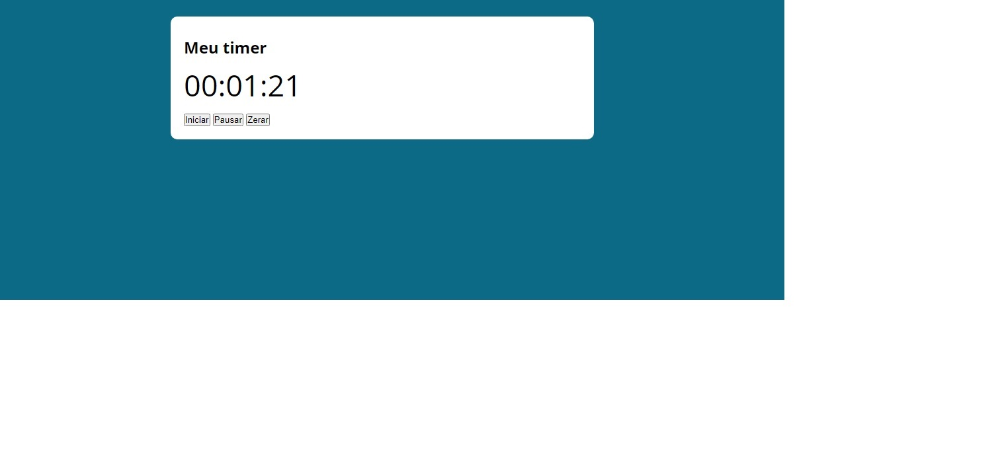

<h1 align="center">Cronômetro Simples</h1>

#Projeto feito para estudo de JavaScript puro, cronomêtro usando JS com setInterval, setTimeOut  

|  <a href="#-tecnologias">Tecnologias</a>&nbsp;&nbsp;&nbsp;|&nbsp;&nbsp;&nbsp;

 

  

## 🚀 Tecnologias

Esse projeto foi desenvolvido com as seguintes tecnologias:

- HTML e CSS
- Git e Github
- JavaScript
---

Feito by Renato de Paula 